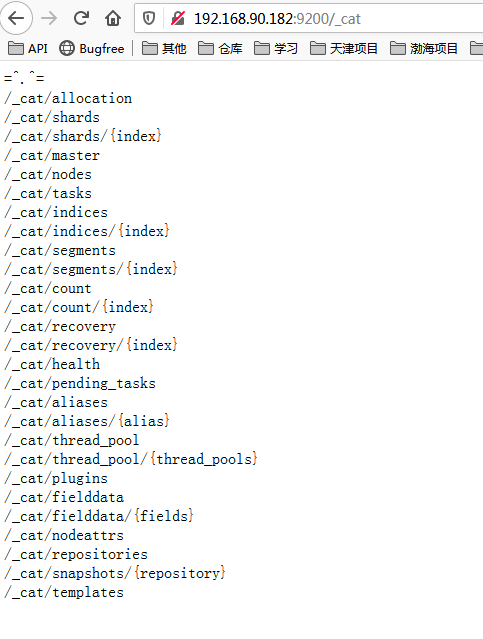

## 1. ES安装

### 下载

[Elasticsearch官方下载地址](https://www.elastic.co/cn/downloads/past-releases#elasticsearch)

这里使用的是elasticsearch-6.4.1版本

### 解压及配置

将压缩包解压到`/usr/local/elasticsearch/`这个目录下，

按照以下说明修改配置文件`./config/elasticsearch.yml`

```shell
cluster.name: my-elastic
node.name: node
node.master: true  
#node.data: true
bootstrap.memory_lock: false
path.data: /home/elastic/data/node
path.logs: /home/elastic/data/log
#本机IP
network.host: 192.168.90.182
network.publish_host: 192.168.90.182
http.port: 9200
transport.tcp.port: 9300
discovery.zen.ping.unicast.hosts: ["192.168.90.182:9300"]
discovery.zen.minimum_master_nodes: 1
cluster.routing.allocation.enable: all
cluster.routing.rebalance.enable: all
#跨域
http.cors.enabled: true
http.cors.allow-origin: "*"
http.cors.allow-credentials: true
action.destructive_requires_name: true
```

### 启动ES

​	**注：必须使用非root用户启动**

#### 创建用户

```shell
#创建群组
groupadd elastic
#创建用户并添加到群组中（useradd -g 群组名 用户名）
useradd -g elastic elastic
#修改用户elastic密码
passwd elastic
```

#### 启动ES

```shell
#切换到新建的用户
su - elastic
cd /usr/local/elasticsearch/
./bin/elasticsearch &
```

### 启动后的问题及解决方式

`1.bootstrap checks failed`

​	修改es配置文件：`config/elasticsearch.yml`
​	`bootstrap.memory_lock: true`
​	改为:
​	`bootstrap.memory_lock: false`

`2.max file descriptors [4096] for elasticsearch process is too low, increase to at least [65536]`

​	修改系统配置文件：`vim /etc/security/limits.conf`

​	在文件最后加入两个配置项（*号后面必须有一个空格）：

```shell
* soft nofile 65536
* hard nofile 65536
```

`3.max virtual memory areas vm.max_map_count [65530] is too low, increase to at least [262144]`

​	修改系统配置文件：`vim /etc/sysctl.conf `

​	添加下面的配置项：`vm.max_map_count=655360`

​	保存并退出后，执行：`sysctl -p` 使配置生效。

## 2. ES常用命令说明

参考: https://www.ituring.com.cn/book/tupubarticle/18380

### 2.1 _cat命令

`_cat`命令是系统信息查询相关的，下面分成好几个子命令分类。

可直接在浏览器中访问：`http://localhost:9200/_cat`，会看到一系列命令：



例如：http://192.168.90.182:9200/_cat/indices，查询ES库中的所有索引。

### 2.2 索引相关命令

ES中一个索引就类似于数据库中一个数据库的概念。当然ES中的数据是非结构化的，意味着索引中的每条记录可以有不同的字段集合。

**注：以下命令为shell命令（{`indexName`}：表示索引名）**

#### 查询索引列表

```shell
curl 192.168.90.182:9200/_cat/indices/{indexName}?v
```

#### 创建索引

```shell
curl -XPUT 192.168.90.182:9200/{indexName}
```

#### 删除索引

```shell
curl -XDELETE 192.168.90.182:9200/{indexName}?pretty
```

### 2.3 查询索引信息

```shell
curl -XGET 192.168.90.182:9200/{indexName}?pretty
```


## 3. ES接口简明教程

ES的核心概念：

| ES的概念 | 数据库概念 |
| -------- | ---------- |
| 索引     | 数据库     |
| 类型     | 表         |
| 字段     | 字段       |

ES中的字段与数据库中的字段一样，有名称和类型。

* **说明**：所有的ES操作都是通过一个类`RestHighLevelClient`来实现的，可通过以下方式创建一个`client`，可通过`@Configuration + @Bean`的方式，将client注册为一个`Spring Bean`，以此可在其他类中使用。

```java
//ipAddress是一个String数组，由多个ip:port组成（ES集群）
String [] ipAddress = new String[]{"ip1:port1","ip2:port2"};
HttpHost[] hosts = Arrays.stream(ipAddress)
                .map(this::makeHttpHost)
                .filter(Objects::nonNull)
                .toArray(HttpHost[]::new);
RestClientBuilder restClientBuilder = RestClient.builder(hosts);
//设置连接超时时间
restClientBuilder.setMaxRetryTimeoutMillis(60000);
//创建客户端链接
RestHighLevelClient client = new RestHighLevelClient(restClientBuilder);
```

### 索引与类型操作

#### 判断索引是否存在

判断`hbtest`索引是否存在：

```java
GetIndexRequest request = new GetIndexRequest();
request.indices("hbtest");

boolean exists = client.indices().exists(request);

logger.info("{}存在性：{}", "hbtest", exists);

```

#### 创建索引

创建`hbtest`索引：

```java
CreateIndexRequest createIndexRequest = new CreateIndexRequest("hbtest");
createIndexRequest.settings(Settings.builder()
        .put("index.number_of_shards", 3) // 分片
        .put("index.number_of_replicas", 2)); // 副本？2个副本，还是包括主的。

client.indices().create(createIndexRequest);

```

#### 创建类型

使用[PutMapping](https://www.elastic.co/guide/en/elasticsearch/client/java-rest/6.3/java-rest-high-put-mapping.html)可以创建类型。创建类型时，需要先整理此类型有哪些字段，每种字段都是什么[数据类型](https://www.elastic.co/guide/en/elasticsearch/reference/current/mapping-types.html)。

我们要在`hbtest`索引上创建`files`类型，它有如下字段：

| 字段名      | 类型    | 用途                                                         |
| ----------- | ------- | ------------------------------------------------------------ |
| fileName    | text    | 文件名                                                       |
| fileContent | text    | 文件内容                                                     |
| open        | boolean | 此文件是否公开。                                             |
| auth        | keyword | 权限信息。存储可以访问此文件的授权信息。这是一个字符串数组。数组项是由`deptId`和`roleId`拼接而成：`${deptId}_${roleId}` |
| userId      | keyword | 有权限看此文件的人员id。字符串数组。                         |
| creator     | keyword | 创建人。                                                     |
| createTime  | date    | 文件创建日期。                                               |

对应的JSON请求为：

```json
{
  "properties": {
    "fileName": {
      "type": "text"
    },
    "fileContent": {
      "type": "text"
    },
    "open": {
      "type": "boolean"
    },
    "auth": {
      "type": "keyword"
    },
    "userId": {
      "type": "keyword"
    },
    "creator": {
      "type": "keyword"
    }
  }
}

```

可以使用[XContentBuilder](https://www.elastic.co/cn/downloads/past-releases#elasticsearch)创建上面的JSON对象，如下：

```java
XContentBuilder builder = XContentFactory.jsonBuilder();
builder.startObject();
{
  builder.startObject("properties");
  {
    builder.startObject("fileName");
    {
      builder.field("type", "text");
    }
    builder.endObject();

    builder.startObject("fileContent");
    {
      builder.field("type", "text");
    }
    builder.endObject();

    builder.startObject("open");
    {
      builder.field("type", "boolean");
    }
    builder.endObject();

    builder.startObject("auth");
    {
      builder.field("type", "keyword");
    }
    builder.endObject();

    builder.startObject("userId");
    {
      builder.field("type", "keyword");
    }
    builder.endObject();

    builder.startObject("creator");
    {
      builder.field("type", "keyword");
    }
    builder.endObject();
    
    builder.startObject("createTime");
    {
      builder.field("type", "date");
    }
    builder.endObject();
  }
  builder.endObject();
}
builder.endObject();

```

然后我们创建`PutMappingRequest`：

```java
PutMappingRequest putMappingRequest = new PutMappingRequest("hbtest"); // hbtest是索引名称
putMappingRequest.type("files"); // 类型名称为files
putMappingRequest.source(builder); // builder是上个步骤创建

```

最后发送创建类型的请求：

```java
client.indices().putMapping(putMappingRequest);
```

#### 删除索引（删库）

```java
DeleteIndexRequest request = new DeleteIndexRequest("hbfiles");

client.indices().delete(request, RequestOptions.DEFAULT);

```

### 操作数据

#### 新增数据

官方称之为“索引”，因为新增数据最核心的一个功能点就是对"text"类型的数据进行分词索引，才能实现全文检索。

[官方API文档](https://www.elastic.co/guide/en/elasticsearch/client/java-rest/6.3/java-rest-high-document-index.html)。

需要将Java对象数据转换成JSON格式数据，才能新增数据。如下面的示例，使用[Gson](https://github.com/google/guava)将Java对象转成JSON：

```java
FileInfo file = new FileInfo(.......);
//                                       索引名称      类型名称   数据id
IndexRequest request = new IndexRequest("hbfiles", "files", file.getFileId());
request.source(new Gson().toJson(file), XContentType.JSON);

IndexResponse response = client.index(request, RequestOptions.DEFAULT);

if (response.getResult() == DocWriteResponse.Result.CREATED) {
	System.out.println("创建成功");
} else if (response.getResult() == DocWriteResponse.Result.UPDATED) {
	System.out.println("修改成功");
}
```

注意：如果库中已经存在数据id，则是覆盖已有数据。

#### 删除数据

[官方API文档](https://www.elastic.co/guide/en/elasticsearch/client/java-rest/6.3/java-rest-high-document-delete.html)。

```java
DeleteRequest request = new DeleteRequest("hbfiles", "files", "1");
client.delete(request, RequestOptions.DEFAULT);
System.out.println("删除成功");
```

DeleteRequest的三个参数分别是：

- 索引名称（库名称），示例代码中是`hbfiles`
- 类型名称（表名称），示例代码中是`files`
- 数据id，示例代码中是`1`

##### 更新

[官方API文档](https://www.elastic.co/guide/en/elasticsearch/client/java-rest/6.3/java-rest-high-document-update.html)。

修改个别字段：

```java
UpdateRequest request = new UpdateRequest("hbfiles", "files", "1")
  .doc(
  	"creator", "userx",
  	"auth", ["001_role2", "002_role3"]
  );

client.update(request, RequestOptions.DEFAULT);
```

如果需要整条数据都更新，则可以使用[新增数据](#新增数据)的知识。

##### 根据id获取数据

[官方API文档](https://www.elastic.co/guide/en/elasticsearch/client/java-rest/6.3/java-rest-high-document-get.html)

```java
GetRequest getRequest = new GetRequest("hbfiles", "files", "1");
GetResponse getResponse = client().get(getRequest, RequestOptions.DEFAULT);

if (getResponse.isExists()) {
  String sourceAsString = getResponse.getSourceAsString();
  FileInfo result = new Gson().fromJson(sourceAsString, FileInfo.class);
} else {
  System.out.println("数据不存在");
}
```

#### 数据查询

官方文档： https://www.elastic.co/guide/en/elasticsearch/client/java-rest/6.3/java-rest-high-search.html

##### 查询所有数据

查询`hbfiles`索引（库）的`files`类型的数据：

```java
// (1)
SearchRequest searchRequest = new SearchRequest("hbfiles");
searchRequest.types("files");
// (2)
SearchSourceBuilder searchSourceBuilder = new SearchSourceBuilder();
searchSourceBuilder.query(QueryBuilders.matchAllQuery());
searchRequest.source(searchSourceBuilder);

// (3)
SearchResponse searchResponse = client().search(searchRequest, RequestOptions.DEFAULT);

// (4)
SearchHits hits = searchResponse.getHits();
long totalHits = hits.getTotalHits().value;
System.out.println(totalHits); // 总数目

// (5)
SearchHit[] searchHits = hits.getHits();
List<FileInfo> fileInfos = Lists.newArrayList();

for (SearchHit hit : searchHits) {
  String sourceAsString = hit.getSourceAsString();

  FileInfo fileInfo = new Gson().fromJson(sourceAsString, FileInfo.class);
  fileInfos.add(fileInfo);
}

System.out.println(new Gson().toJson(fileInfos));
```

(1)和(2)两部分代码在构建查询请求。

(3)在发送查询请求。

(4)和(5)部分在处理查询到的结果。

第(2)部分是重点，用来构建查询条件的。本示例中使用`QueryBuilders.matchAllQuery()`，表示匹配所有数据。

##### 分页查询

使用`SearchSourceBuilder`的`from`和`size`两个方法即可构建出分页查询。

```java
SearchSourceBuilder searchSourceBuilder = new SearchSourceBuilder();
searchSourceBuilder.from(0);
searchSourceBuilder.size(10);
```

##### 指定简单查询条件

使用`QueryBuilders`可创建查询条件。如查询创建人是`user1`的数据：

```java
SearchSourceBuilder searchSourceBuilder = new SearchSourceBuilder();
searchSourceBuilder.query(QueryBuilders.termQuery("creator", "user1"));
```

`QueryBuilders.termQuery`用来构建精确查询。

##### 采用全文检索条件

`QueryBuilders.matchQuery()`可用来构建全文检索查询：

```java
SearchSourceBuilder searchSourceBuilder = new SearchSourceBuilder();
searchSourceBuilder.query(QueryBuilders.matchQuery("fileContent", "中国"));
```

可以使用`QueryBuilders.multiMatchQuery()`一次性指定多个查询字段：

```java
SearchSourceBuilder searchSourceBuilder = new SearchSourceBuilder();
searchSourceBuilder.query(QueryBuilders.multiMatchQuery("中国", "fileContent", "fileName"));
```

如果需要做查询效果优化，可以参考一下[官方文档](https://www.elastic.co/guide/en/elasticsearch/reference/current/full-text-queries.html)。

##### 范围查询

[范围查询规范](https://www.elastic.co/guide/en/elasticsearch/reference/6.4/query-dsl-range-query.html)

`QueryBuilders.rangeQuery()`可用来构建范围查询，如日期区间段：

```java
SearchSourceBuilder searchSourceBuilder = new SearchSourceBuilder();
searchSourceBuilder.query(
  QueryBuilders.rangeQuery("createTime")
    .format("yyyy-MM-dd||yyyy")
    .from("2018")
    .to("2019-07-21")
);

```

##### 数组查询

`QueryBuilders.termsQuery()`可用来构建数组查询。如查询权限字段`auth`为`001_role1`或者`001001_role2`的字段：

```java
searchSourceBuilder.query(
				QueryBuilders.termsQuery("auth", "001_role1", "001001_role2")
);

```

##### 指定多个查询条件

查询条件可以通过逻辑关系组合在一起。es提供了以下逻辑关系：

- `must` - 如果有多个条件，这些条件都必须满足。参与到打分项，相当于`AND`。
- `should` - 如果有多个条件，满足一个或多个即可。参与到打分项，相当于`OR`。
- `must_not` - 与`must`相反，必须都不满足条件才可以匹配到。相当于`!`。
- `filter` - 过滤，不参与到打分项。

可以使用`QueryBuilders.boolQuery()`将这些添加组合在一起，也可以嵌套使用。

要想组合查询条件，需要从`QueryBuilders.boolQuery()`开始。如下面的示例，查询标题或者文件内容包含”中国“，但是`auth`为`001_role1`或者`001001_role2`或者创建人是`user1`的数据：

```java
QueryBuilder queryBuilder = QueryBuilders.boolQuery()
  .must(
		QueryBuilders.multiMatchQuery("中国", "fileName", "fileContent")
	)
  .filter(
  	QueryBuilders.boolQuery()
  		.should(
    		QueryBuilders.termsQuery("auth", "001_role1", "001001_role2")
  		)
  		.should(
        QueryBuilders.termQuery("creator", "user1")
      )
	);

```

##### 排序

es默认按照分数排序的，可以添加排序规则。如按照分数升序降序：

```java
sourceBuilder.sort(new ScoreSortBuilder().order(SortOrder.DESC));

```

再如按照日期排序：

```java
sourceBuilder.sort(new FieldSortBuilder("createTime").order(SortOrder.DESC));

```

##### 高亮（请求构建）

我们需要在构建查询请求时，指定哪些字段需要高亮。如下所示：

```java
class Demo {
  /**
   * 构建高亮字段的请求。
   */
  public HighlightBuilder highlightFields() {
		HighlightBuilder highlightBuilder = new HighlightBuilder();
    
		HighlightBuilder.Field highlightFileName = new HighlightBuilder.Field("fileName");
		highlightBuilder.field(highlightFileName);
    
		HighlightBuilder.Field highlightContent = new HighlightBuilder.Field("fileContent");
		highlightBuilder.field(highlightContent);

		return highlightBuilder;
	}
  
  public List<FileInfo> query() {
    //...
    SearchSourceBuilder searchSourceBuilder = new SearchSourceBuilder();
    searchSourceBuilder.highlighter(highlightFileds());
    //...
  }
}

```

##### 高亮（返回值处理）

在返回值中有高亮的数据。如下所示：

```java
SearchHits hits = searchResponse.getHits();
for (SearchHit hit : hits.getHits()) {
    Map<String, HighlightField> highlightFields = hit.getHighlightFields();
  
    HighlightField fileNameHightlight = highlightFields.get("fileName");
  	if (fileNameHightlight != null && fileNameHightlight.isFragment()) {
      Text[] fragments = fileNameHightlight.fragments();  
    	String fragmentString = fragments[0].string();
      System.out.print("fileName高亮文本是：");
      System.out.println(fragmentString);
    }
    
  	HighlightField fileContentHightlight = highlightFields.get("fileContent");
  	if (fileContentHightlight != null && fileContentHightlight.isFragment()) {
      Text[] fragments = fileContentHightlight.fragments();  
    	String fragmentString = fragments[0].string();
      System.out.print("fileContent高亮文本是：");
      System.out.println(fragmentString);
    }
}

```

##### 如何做查询结果优化

- 分词优化
- 查询优化

[Elasticsearch搜索中文分词优化](https://www.jianshu.com/p/914f102bc174)

## 总结

### 各类请求总结

任何一个ES操作都需要先创建一个请求request

| 序号 | 请求                              | 说明           |                             备注                             |
| :--: | --------------------------------- | :------------- | :----------------------------------------------------------: |
|  1   | GetIndexRequest()                 | 获取索引的请求 | client.indices().exists(request,<br />RequestOptions.DEFAULT) |
|  2   | CreateIndexRequest(indexName)     | 创建索引的请求 |               client.indices().create(request)               |
|  3   | PutMappingRequest(indexName)      | 创建类型的请求 |             client.indices().putMapping(request)             |
|  4   | DeleteIndexRequest(indexName)     | 删除索引的请求 | client.indices().delete(request, <br />RequestOptions.DEFAULT) |
|  5   | IndexRequest(indexName, type, ID) | 索引请求       |     client.index(request, <br />RequestOptions.DEFAULT)      |
|  6   | DeleteRequest(indexName, type,ID) | 删除数据请求   |     client.delete(request,<br />RequestOptions.DEFAULT)      |
|  7   | UpdateRequest(indexName, type,ID) | 更新请求       |     client.update(request,<br />RequestOptions.DEFAULT)      |
|  8   | GetRequest(indexName, type,ID)    | 根据ID查询请求 |       client.get(request,<br />RequestOptions.DEFAULT)       |
|  9   | SearchRequest(indexName)          | 查询请求       |    client().search(request, <br />RequestOptions.DEFAULT)    |

### 查询条件总结

| 序号 | 查询类型       | 方法            | 示例                                                         |                          说明                           |
| :--: | -------------- | --------------- | ------------------------------------------------------------ | :-----------------------------------------------------: |
|  1   | 精确查询       | termQuery       | QueryBuilders.termQuery("creator", "user1")                  |              查询creator字段为user1的数据               |
|  2   | 全文检索查询   | matchQuery      | QueryBuilders.matchQuery("content", "中国")                  |     匹配content字段包含“中国”的数据（类似like查询）     |
|  3   | 多字段全文检索 | multiMatchQuery | QueryBuilders.multiMatchQuery("中国", "content", "name")     |          匹配content或name字段包含“中国”的数据          |
|  4   | 范围查询       | rangeQuery      | QueryBuilders.rangeQuery("createTime")<br />.format("yyyy-MM-dd\|\|yyyy")<br />.from(startDate).to(endDate) | 如果是日期，需要用format指定日期类型,可指定多个日期格式 |
|  5   | 数组查询       | termsQuery      | QueryBuilders.termsQuery("auth", "001", "001001",······)     |               auth字段有一个精确匹配即可                |

