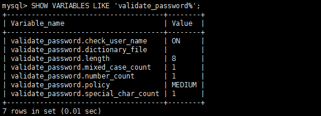

## 问题 1： 创建用户，报密码策略问题异常信息：

```bash
ERROR 1819 (HY000): Your password does not satisfy the current policy requirements
```
原因：创建的用户密码不遵守密码策略

解决方案：

  - 修改密码为字符串、数字、特殊符号组成的复杂密码
   
  - 修改密码策略

   1. 查看 mysql 初始的密码策略。

   ```bash
   SHOW VARIABLES LIKE 'validate_password%';
   ```
   

   2. 设置密码的验证强度等级。

   ```bash
   set global validate_password.policy=0;
   ```
   3. 设置密码的长度。
      
   ```bash
    set global validate_password.length=6;
   ```

:::info
   注意：mysql 5 和 mysql 8+ 的 validate_password 下参数不一致，设置需要改变。
:::

## 问题 2： 远程连接报错：

 ```bash
 ERROR 2059 (HY000): Authentication plugin 'caching_sha2_password' cannot be loaded; 
 ```

   原因：mysql 8.0 默认使用`caching_sha2_password`身份验证机制之前版本的mysql使用`mysql_native_password`

   注意：从之前版本升级 8.0 版本的不会改变现有用户的身份验证方法，仍然采用`mysql_native_password`的验证方式；但新用户会默认使用新的`caching_sha2_password` 。

   解决方案：
    
   - 方案一：修改身份验证机制
   ```bash
   #修改加密规则 
   ALTER USER 'username'@'localhost' IDENTIFIED BY 'password' PASSWORD EXPIRE NEVER; 
   #更新一下用户的密码 
   ALTER USER 'username'@'localhost' IDENTIFIED WITH mysql_native_password BY 'password';   
   #刷新权限 
   FLUSH PRIVILEGES;
   ```
   - 方案二：修改my.cnf配置文件

   将默认的认证插件修改为mysql_native_password

   ```properties title="~/my.cnf"
   default_authentication_plugin=mysql_native_password
   ```
## 问题 3：未设置远程连接权限报错：

   ```bash
  ERROR 1045 (HY000): Access denied for user 'username'@'localhost'(using password: YES）; 
   ```
  原因：只授权了本地登陆，说明这个授权适用于mysql_exporter监控工具部署在MySQL Server上的情况，如果是部署在Prometheus Server上，则需要授权远程登陆。

  解决方案：
  ```bash
  grant REPLICATION CLIENT, PROCESS, SELECT on *.* to 'exporter'@'%';
  flush privileges;
  ```
  参数说明：

  'exporter'@'%'参数：exporter为授权登录的数据库账户，百分号（%）为IP地址占位符。假如要限制只能通过127.0.0.1的IP地址登录，则需要把%改成127.0.0.1。如果填%则代表允许任何IP地址登录。

## 问题 4：mysql8 grant授权报错：
   ```bash
  ERROR 1410 (42000): You are not allowed to create a user with GRANT
   ```
  原因：mysql8 使用grant修改账户权限分配以外的账户属性。包括认证，SSL，和资源限制配置等。取而代之的是创建用户create user或者创建后修改alter user的方式。

  解决方案：
  ```bash
  update mysql.user set host='%' where user='exporter';
  # 需要执行两次
  grant REPLICATION CLIENT, PROCESS, SELECT on *.* to 'exporter'@'%';
  flush privileges;
  ```