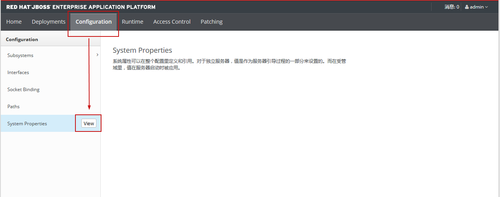
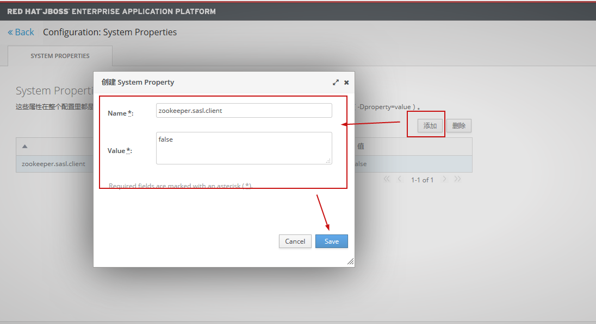

> - `JBoss`版本：7.1.0
>
> - 以下内容均为`JBoss`在`standalone`启动模式下的说明及配置

[官方文档地址（英文[配置指南]，无中文版）](https://access.redhat.com/documentation/en-us/red_hat_jboss_enterprise_application_platform/7.1/pdf/configuration_guide/Red_Hat_JBoss_Enterprise_Application_Platform-7.1-Configuration_Guide-en-US.pdf)

[官方文档地址（中文[起步指南]）](https://access.redhat.com/documentation/zh-cn/red_hat_jboss_enterprise_application_platform/7.1/pdf/getting_started_guide/Red_Hat_JBoss_Enterprise_Application_Platform-7.1-Getting_Started_Guide-zh-CN.pdf)

## 启动`JBoss`

Standalone 方式启动

```shell
 --Linux
 ${EAP_HOME}/bin/standalone.sh
 --后台启动
 nohup ${EAP_HOME}/bin/standalone.sh &
 --Windows
 ${EAP_HOME}\bin\standalone.bat
```

## 停止`JBoss`

1. 非后台启动，可采用`Ctrl+c`的方式停止JBoss；

2. 后台启动可使用`JBoss`命令的方式停止

   ```shell
   --连接后台控制程序
   ${EAP_HOME}/bin/jboss-cli.sh --connect
   --执行停止命令
   shutdown
   --退出后台程序（或者使用exit）
   quit
   ```

3. 直接杀进程

## 配置应用发布名

> 注：如果部署包名同需要的应用上下文相同，可不进行该项配置；例如`sso.war`，应用上下文也是`sso`，则可不配置此项。

在应用`WEB-INF`目录下添加`jboss-web.xml`文件，并在文件中编写以下内容：

```xml
<jboss-web>
    <!-- 配置应用发布名(上下文) -->
	<context-root>/</context-root>
</jboss-web>
```

以上配置将替换掉`JBoss`的默认欢迎页面

## 修改`JBoss`端口

修改配置文件`${EAP_HOME}/standalone\configuration\standalone.xml`

在文件的最后，找到如下配置项：

```xml
<socket-binding-group name="standard-sockets" default-interface="public" port-offset="${jboss.socket.binding.port-offset:0}">
        <socket-binding name="management-http" interface="management" port="${jboss.management.http.port:9990}"/>
        <socket-binding name="management-https" interface="management" port="${jboss.management.https.port:9993}"/>
        <socket-binding name="ajp" port="${jboss.ajp.port:8009}"/>
        <socket-binding name="http" port="${jboss.http.port:8080}"/>
        <socket-binding name="https" port="${jboss.https.port:8443}"/>
        <socket-binding name="txn-recovery-environment" port="4712"/>
        <socket-binding name="txn-status-manager" port="4713"/>
        <outbound-socket-binding name="mail-smtp">
            <remote-destination host="localhost" port="25"/>
        </outbound-socket-binding>
    </socket-binding-group>
```

其中`<socket-binding name="http" port="${jboss.http.port:8080}"/>`配置的就是应用部署的端口，默认为8080，可根据需要修改为想要的端口。

> 说明：
>
> * 如果一个服务器中需要部署多个`JBoss`，其余端口也都需要改成与其他`JBoss`不同的端口。
>
> * 或者修改标签`<socket-binding-group>`的`port-offset`属性，将0改为任意整数n（可正可负），表示将所有端口偏移n位（但是此种方式也会将应用部署的端口进行偏移，因此设置应用部署端口时需要根据偏移量进行计算设置）。

## 应用部署及解部署

### 1. WAR包部署

#### 方式1

> 此方式通过`JBoss`提供命令方式进行部署。部署灵活，部署包可在服务器任意路径下。但是部署过程中不会打印启动日志，当出现异常时会提示异常信息。

```shell
--连接后台控制程序（JBoss处于启动状态）
${EAP_HOME}/bin/jboss-cli.sh --connect
--通过部署命令部署
deploy /opt/app/uias.war
--解部署(命令undeploy 部署名称，默认跟部署包名一致)
undeploy uias.war
```

#### 方式2

> 类似Tomcat的部署方式

直接将要部署的包，放到`JBoss`指定目录下，`JBoss`如果是启动状态，会自动部署应用包，如果是停止状态，在启动`JBoss`时会部署应用。

`JBoss`部署目录：`${EAP_HOME}\standalone\deployments\`

解部署：


#### 方式3

> 控制台界面部署
>
> 好处：界面方便操作
>
> 弊端：需要手动指定（手写，不能选择）部署包在服务器上的路径，或者选择本地部署包上传到服务器。

不推荐此方式，这里不再详细说明。

### 2. 文件夹部署

#### 2.1 修改 JBoss 配置

JBoss默认配置是不会自动部署文件夹的，如果要部署文件夹，则需要修改**JBOSS**配置，配置方式有以下两种：

* **直接修改配置文件**

找到 JBoss 配置文件`EAP_HOME/standalone/configuration/standalone.xml`，找到如下配置：

```xml
<subsystem xmlns="urn:jboss:domain:deployment-scanner:2.0">
            <deployment-scanner path="deployments" relative-to="jboss.server.base.dir" scan-interval="5000" runtime-failure-causes-rollback="${jboss.deployment.scanner.rollback.on.failure:false}"/>
</subsystem>
```

在`<deployment-scanner>`标签中添加属性`auto-deploy-exploded="true"`，意思为：自动部署文件夹。

> **注**：不推荐使用该方式。因为手动修改需要重启 JBOSS，配置才能生效。

* **通过命令方式修改配置文件**

  ```shell
  --连接管理CLI
  EAP_HOME/bin/jboss-cli.sh --connect
  --修改配置
  /subsystem=deployment-scanner/scanner=default:write-attribute(name=auto-deploy-exploded,value=true)
  ```

  

#### 2.2 部署文件夹

然后将要部署的文件夹重名为以【*.war*】结尾的。例如要部署名为*uias*的文件夹，则需要将文件夹重命名为：*uias.war*。将重命名后的文件夹，放到 JBoss的部署目录下（`EAP_HOME/standalone/deployments/`）。

等待部署目录下会生成一个后缀为 *.depolyed* 的文件，表示部署成功。如果部署失败，会生成一个 *.failed* 为后缀的文件。

## 解决JBoss启动时无法连接zookeeper的问题

### 方法一

找到JBoss配置文件`${JBOSS_HOME}\standalone\configuration\standalone.xml`,在配置文件中找到以下配置：

```xml
<extensions>
    ......
    <extension module="org.jboss.as.sar"/>
    <extension module="org.jboss.as.security"/>
    <extension module="org.jboss.as.transactions"/>
    <extension module="org.jboss.as.webservices"/>
    <extension module="org.jboss.as.weld"/>
    ......
</extensions>
```

将标签`<extension module="org.jboss.as.security"/>`删掉。

> 注：该标签一般都在配置文件最上方。

然后在再找到以下配置：

```xml
<profile>
    ......
    <subsystem xmlns="urn:jboss:domain:security:2.0">
        <security-domains>
            ......
        </security-domains>
    </subsystem>
    ......
</profile>
```

将标签`<<subsystem>`以及标签中的内容全部删除。

### 方法二

在`jboss`中设置系统变量`zookeeper.sasl.client`为`false`，绕过`Zookeeper`服务器的`SASL`身份验证。

配置步骤：

1. 在JBoss启动状态下，登录控制台（控制台地址：http://localhost:9990/console/index.html），依次点击`Configuration`——`System Properties`，点击`View`查看。

   

2. 在打开页面中，点击`添加`，填写Name为`zookeeper.sasl.client`，value为`false`，然后点击保存，即可。

   

> 注：此方法，会导致项目在启动过程中，打印【警告】日志，提示`Zookeeper`身份验证失败，以及`Will continue connection to Zookeeper server without SASL authentication, if Zookeeper server allows it.`(如果`Zookeeper`服务器允许，将继续连接到`Zookeeper`服务器，而不进行`SASL`身份验证)。
>
> 不影响程序正常调用`zookeeper`服务，应用可正常运行。

报错信息如下：

```java
Could not login: the client is being asked for a password, but the Zookeeper client code does not currently support obtaining a password from the user. Make sure that the client is configured to use a ticket cache (using the JAAS configuration setting 'useTicketCache=true)' and restart the client. If you still get this message after that, the TGT in the ticket cache has expired and must be manually refreshed. To do so, first determine if you are using a password or a keytab. If the former, run kinit in a Unix shell in the environment of the user who is running this Zookeeper client using the command 'kinit <princ>' (where <princ> is the name of the client's Kerberos principal). If the latter, do 'kinit -k -t <keytab> <princ>' (where <princ> is the name of the Kerberos principal, and <keytab> is the location of the keytab file). After manually refreshing your cache, restart this client. If you continue to see this message after manually refreshing your cache, ensure that your KDC host's clock is in sync with this host's clock.
2019-11-14 20:53:29 [ WARN ] - SASL configuration failed: javax.security.auth.login.LoginException: java.lang.NullPointerException
	at org.jboss.as.security.RealmDirectLoginModule.validatePassword(RealmDirectLoginModule.java:233)
	at org.jboss.security.auth.spi.UsernamePasswordLoginModule.login(UsernamePasswordLoginModule.java:283)
	at org.jboss.as.security.RealmDirectLoginModule.login(RealmDirectLoginModule.java:157)
	at sun.reflect.NativeMethodAccessorImpl.invoke0(Native Method)
	at sun.reflect.NativeMethodAccessorImpl.invoke(NativeMethodAccessorImpl.java:62)
	at sun.reflect.DelegatingMethodAccessorImpl.invoke(DelegatingMethodAccessorImpl.java:43)
	at java.lang.reflect.Method.invoke(Method.java:497)
	at javax.security.auth.login.LoginContext.invoke(LoginContext.java:755)
	at javax.security.auth.login.LoginContext.access$000(LoginContext.java:195)
	at javax.security.auth.login.LoginContext$4.run(LoginContext.java:682)
	at javax.security.auth.login.LoginContext$4.run(LoginContext.java:680)
	at java.security.AccessController.doPrivileged(Native Method)
	at javax.security.auth.login.LoginContext.invokePriv(LoginContext.java:680)
	at javax.security.auth.login.LoginContext.login(LoginContext.java:587)
	at org.apache.zookeeper.Login.login(Login.java:292)
	at org.apache.zookeeper.Login.<init>(Login.java:93)
	at org.apache.zookeeper.client.ZooKeeperSaslClient.createSaslClient(ZooKeeperSaslClient.java:198)
	at org.apache.zookeeper.client.ZooKeeperSaslClient.<init>(ZooKeeperSaslClient.java:104)
	at org.apache.zookeeper.ClientCnxn$SendThread.startConnect(ClientCnxn.java:943)
	at org.apache.zookeeper.ClientCnxn$SendThread.run(ClientCnxn.java:993)
	
 Will continue connection to Zookeeper server without SASL authentication, if Zookeeper server allows it.
```

