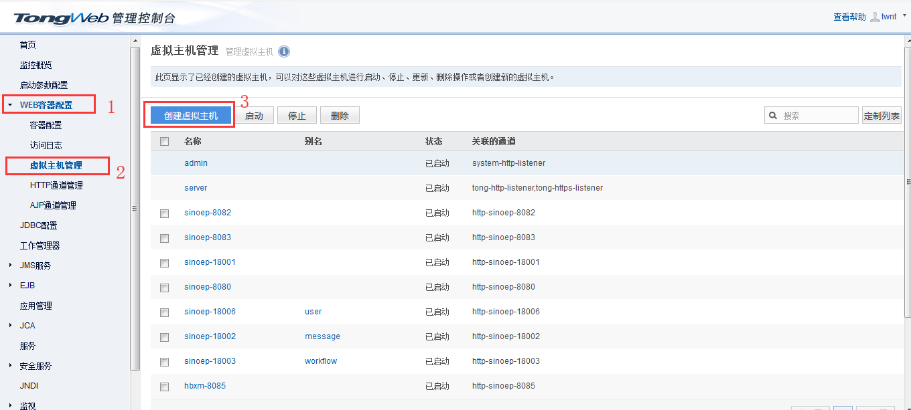
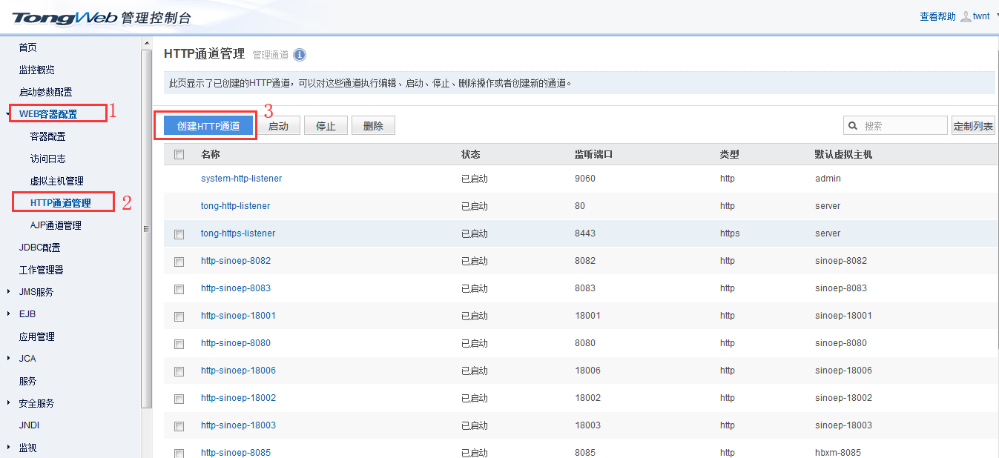
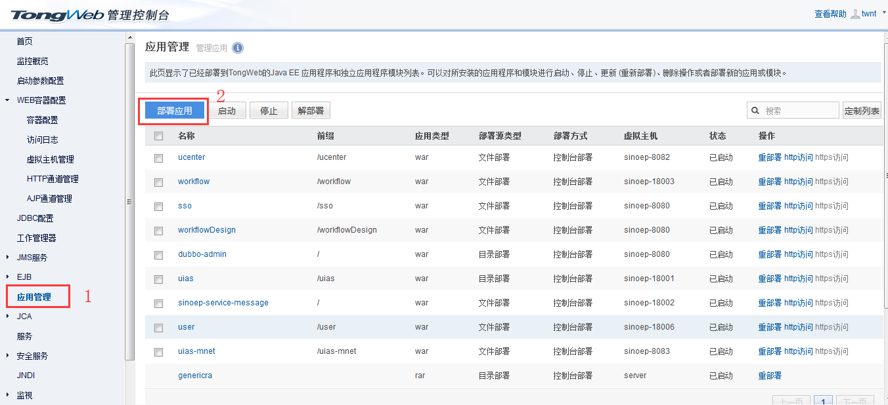

# TongWeb安装及部署

## 安装

百度网盘下载地址：https://pan.baidu.com/s/1J4lRMnen6Fx6e6pTBgXMXg

提取码：ka5g 

## 部署

安装完成之后，浏览器中访问：http://IP:9060/console/rest，进入东方通控制台

用户名：twnt

密码：twnt123.com

### 1.创建虚拟主机

1.填写虚拟主机名称；

2.通道列表选择“都不选”；

3.点击“保存”

### 2.创建HTTP通道

1.填写通道名称；

2.填写监听端口；

3.选择默认虚拟主机（第一步中创建的虚拟主机）；

4.点击“下一步”，无需任何操作，直接点击“完成”。

### 3.部署应用

* 部署方式分为两种：
  * 压缩包部署（支持war、rar、zip等）
  * 文件夹部署

**注：如果是压缩包部署，一旦部署失败，东方通将会把解压后的文件删除，不利于修改重部署，因此不建议使用此方式部署，建议使用文件夹部署**

1.点击“部署应用”；

2.文件位置：本机、服务器

* 本机：只支持压缩包部署（不建议使用）
* 服务器：支持两种部署方式，需要先将需要部署的文件夹上传到服务器路径下。

3.选择服务器部署后，选择要部署的文件夹（这里采用文件夹部署）

4.点击“开始部署”；

5.根据需要修改“应用名称”、“应用前缀”（应用前缀即应用的发布名、部署后的应用上下文）；

6.点击“下一步”

7.选择第一步中创建的虚拟主机；

8.点击“完成”；

9.等待部署进度条结束后，提示“部署成功”。

#### 部署失败

若提示部署失败，可点击查看详情，会将应用启动日志下载下来，查看日志是否有报错，根据报错信息，修改应用代码；然后在“应用管理”列表，点击对应应用后面的“重部署”，然后直接点击“确定”即可。若仍然部署失败，则重复上述操作，直到部署成功。