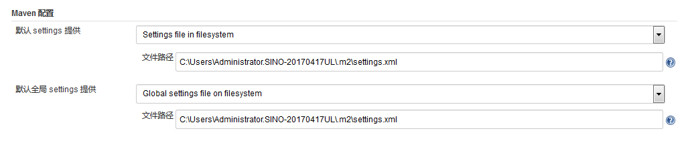

# jenkins自动化构建部署任务

jenkins官方下载地址：https://jenkins.io/zh/download/

> 这里使用的`windows`版本的`jenkins-2.204.2` MSI安装版。

## 安装及配置

### 安装

> 安装环境要求：
>
> * 内存：256M，建议大于512M
> * 硬盘：10GB
> * JDK：Jave8或以上版本（JRE或JDK均可，jenkins运行所需）

双击安装，按照提示步骤进行安装。详细过程省略。

### 配置jenkins环境

安装完成之后，在浏览器登录jenkins，在“管理jenkins”中找到“全局工具配置”，这里可以配置全局`maven`、`JDK`、`Ant`、`Gradle`、`Docker`等环境。

#### 1. Maven环境

指定maven的`settings.xml`文件的位置。

再向下还有安装maven

依次填写`name`可随意填写，需要先取消复选框`Install automatically`的勾选状态，`MAVEN_HOME`才会出现，`MAVEN_HOME`填写环境变量中的配置。`Install automatically`表示自动安装，`jenkins`会根据自动安装中的配置，安装对应的MAVEN，如果服务器上有，则不需要安装。

配置完成后，点击页面下方的“保存”或“应用”按钮。

#### 2. JDK环境

* 注：JDK最好是1.8或以上版本。

点击“JDK安装...”，

配置方式同maven相同，填写`JDK`名称，`JAVA_HOME`，复选框**不要勾选**，然后保存或应用。

#### 3. Ant环境

可根据是否需要，决定是否配置`Ant`。配置方式与上面的配置方式相同。

## Maven + SVN项目

> 环境说明：
>
> * 系统：windows
>
> * jenkins：jenkins-2.204.2
>
> * maven：apache-maven-3.1.0-alpha-1
>
> * jdk：jdk1.8.0_65

### 下载插件

在浏览器中访问`jenkins`地址：`http://localhost:port`（端口为上面安装时设置的端口）

输入上面安装时，配置的用户名密码登录进来后，点击左侧的

图标，找到如下“插件管理”设置项：

点击打开。这里可以看到`jenkins`中所有的插件，包括*已安装*的，以及*可选插件*（未安装）的，

#### 1. Maven插件

* 该插件用来对`maven`项目进行编译打包

在已安装中查找`Pipeline Maven Integration Plugin`插件，如果没有，需要在“可选插件”中找到并安装。

勾选需要安装的插件，然后点击“直接安装”按钮（**注意：安装完成后，需要重启jenkins才能生效！**），

#### 2. SSH插件

* 该插件用来将`maven`生成的打包文件，远程传输到远程服务器上，并可执行一些脚本。

  在已安装中查找`Publish Over SSH`插件，如果没有，需要在“可选插件”中找到并安装。

### 新建自动化任务

#### 1. 新建任务

插件安装完成之后，回到jenkins主页面，点击左侧图标，新建任务。

1. 输入任务名称（自定义）；
2. 选择任务类型。这里选择图中所示：构建一个多配置项目（Multi-configuration project）;
3. 点击确定。

#### 2. 构建任务流程

点击确定之后，进入如下配置页面，按照顺序，配置详细的任务流程。

##### 2.1 基础配置（General）

填写项目描述。

##### 2.2 源码管理

**1. Repository URL**

填写`SVN`项目地址，例如：`http://ip:port/svn/source/elasticsearch/tika-server`；

**2. Credentials**

选择`SVN`凭据，如果是第一次配置，点击右侧的“添加”按钮，添加凭据，

凭据类型选择“Username with password”，意思为用户名密码凭据，然后依次填写`SVN`用户名及密码，描述可填可不填，然后点击“添加”按钮。

**3. Local module directory**

本地项目路径，意为从SVN下载下来的源码保存位置（相对于jenkins工作空间的路径）。默认这里是一个点（.），表示将项目直接签出到工作区中；如果保留为空，则`URL`的最后一个路径将用作默认值。

#### 3. 构建

点击“增加构建步骤”，选择“Invoke top-level Maven targets”。

选择`Maven`版本，这里是从`jenkins`全局配置的`Maven`环境中选择的。

目标：这里填写的是`Maven`命令，上图的中的命令意为，先执行`clean`，然后在执行`install`命令，两个命令中间有一个空格。也可以点击右侧的箭头，改为多行模式，在此模式下，每行一个命令。

#### 4. 构建后操作

点击*增加构建后操作步骤*，选择*Send build artifacts over SSH*。意思为，将上一步`Maven`打包后的包，利用`SSH`远程发送到远程服务器上。

**1. SSH Server**

选择jenkins系统配置中，配置的SSH服务器；

**2. Source files**

资源文件，要上传到服务器上的文件路径（相对于jenkins工作区目录）

**3. Remove prefix**

移除前缀目录，表示发送到服务器时，不会创建该前缀目录。

**4. Remote directory**

服务器存放路径，由于`SSH Server`配置中，配置了基础路径`/usr/local`，因此，这里配置的路径是相对于基础路径下的路径。比如，示例中填写`APP`，则最终在服务器上，上传文件所在的路径将是`/usr/local/APP`。

**5. Exec command**

上传完成后，需要执行的一系列脚本命令。比如：原部署包的备份，中间件的停启动命令等一系列命令。

可以将需要的一系列命令写成一个`.sh`脚本放在服务器上，这里只需要执行编写好的脚本文件，即可完成想要的一系列部署操作。

#### 5. 保存

配置完成之后，点击*保存* 或 *应用*。

### 执行任务

配置完成后，点击项目下的`Build New`，立即开始执行任务。

